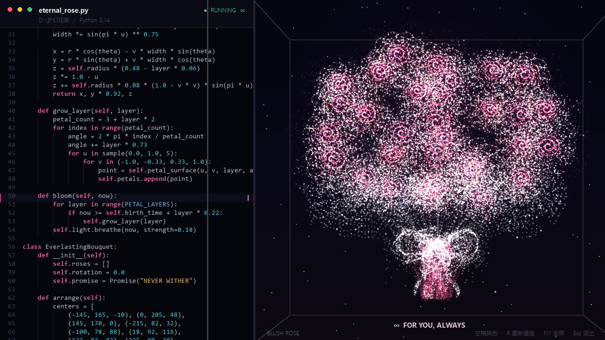

# Eternal Rose Code · 永不凋零的玫瑰花束

一束由 Python 与粒子动画生成、会持续旋转盛放的玫瑰花束。



## Windows 直接运行（无需安装 Python）

下载本仓库后，打开 `portable` 文件夹并双击：

`永不凋零的玫瑰花束.exe`

适用于 64 位 Windows 10 / Windows 11。该 EXE 为未签名的个人作品；仅在确认文件来自可信来源时运行。

## 从源码运行

```powershell
python -m pip install -r requirements.txt
python eternal_bouquet.py
```

## 操作

| 按键 | 功能 |
| --- | --- |
| `R` | 让花束重新盛开 |
| `空格` | 切换花束配色 |
| `F11` | 进入 / 退出全屏 |
| `Esc` | 退出 |

## 画面特点

- 玫瑰花冠、灰绿花托、白纱蝴蝶结与酒红短茎均为代码生成。
- 花束与展示框使用同一套三维旋转；一圈约 36 秒。
- 左侧是与效果呼应的代码滚动界面，右侧为实时粒子花束。

## 依赖

- Python 3.14（仅源码运行需要）
- numpy
- pygame-ce

